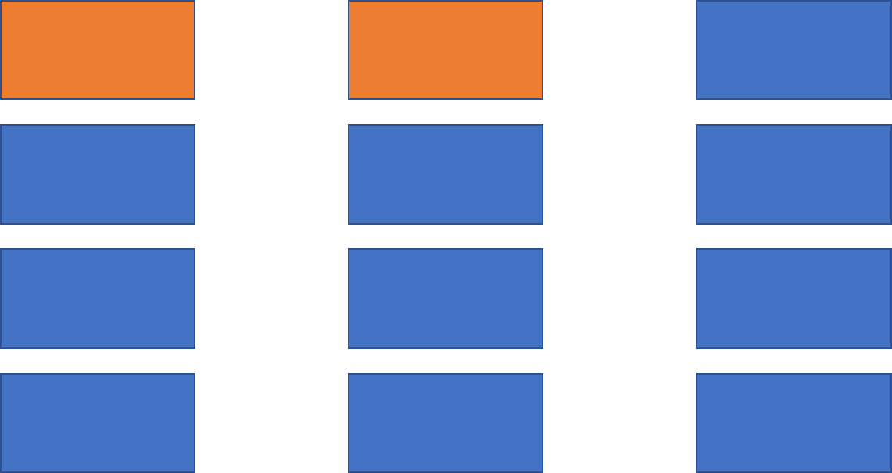

## 一种基于举例的空间相似性搜索算法

### 1、论文介绍
#### 论文名称
Example-based Spatial Search at Scale
ICDE 2022

#### 背景介绍
本文提出了一种基于举例的空间相似性搜索算法，即由用户在空间中给出一组POI作为一个例子，系统根据该例子的特点和地理特性，在空间中搜索出和例子最相近的k个POI组（tuple），系统输出的结果应当同时具有属性相似度和空间相似度。
传统的空间相似度搜索算法采用穷举法，时间复杂度很高，本文提出了一种新的搜索算法，将搜索速度降低了几个数量级。

#### 问题定义
本文中定义的tuple之间的相似度包含属性相似度和空间相似度
 $ SIM(t_1,t_2) = \alpha \cdot SIM_s(t_1,t_2) + (1-\alpha) \cdot SIM_a(t_1,t_2) $

并且为了使输出的tuple中各个点之间的距离和给定的例子tuple（下文称t*）类似，对输出的tuple做如下限制
$ \frac {1}{\beta} \le \frac {||V_{t1}||}{||V_{t2}||} \le \beta $

因此，本文设计的算法的目的是以低时间复杂度找出满足限制条件的具有最大相似度的k个tuple

#### 算法思想
利用分割cell的方式，将传统的点枚举变为cell枚举，并利用边界条件来过滤掉一批候选点，以此减少计算量

#### 方法介绍
1.分割子空间
将整个空间分割成若干个子空间

通过这种分割方法，可以保证要找的tuple一定在这个空间内

2.分割cell
将每个子空间分割成d*d个cell

3.挂cell
对于t*，令其长度为m，在t*中的每个元素t\*[i]，令a为它具有category，遍历子空间中的所有cell，将所有包含有category为a的point的cell组成一个列表，并在cell中对point进行采样（后文介绍），按照属性相似度排序,因此共得到m个列表

4.cell枚举
使用上一步得到的m个cell列表，利用深度遍历的方式来遍历cell，深度每次加1，计算输出tuple的相似度上限，如果小于目前的第k大的相似度，则进行剪枝（后文介绍），不再继续遍历之后的cell

</np>
遍历时相似度上限小于已有的第k大的相似度

跳过后面的cell，直接到下一个

5.point枚举
由上一步得到cell tuple，对每个cell中的所有point，按照其和t*[i]的相似度倒叙排列，得到m个列表。
从每一个列表中选取一个point，组成point tuple，用一个数组表示point tuple，例如[1,2,3,4]表示在第一个列表中取第一个点，第二个列表中取第二个点……
若两个tuple只有一个维度的数据不同，且相差为1，则称这两个tuple为邻接tuple
将每一个point tuple抽象为一个点，则一个cell tuple中的所有point tuple可以组成一个图，其中邻接的point tuple之间有边相连，边长为两个tuple和t*之间的相似度之差，即
$ edge(t_1,t_2) = SIM_a(t_1,t^*) - SIM_a(t_2,t^*) $
定义图的根节点$ r_0 $为[1,1,1,……]
找出和根节点距离最近的k个点，即为point枚举所得的k个point tuple

#### 细节补充
1.采样方式
在对cell中的point进行采样时，选取cell中和对应的t*[i]具有最大的相似度的$ \xi $个point
2.剪枝方式
设tuple长度为m，目前遍历的cell数量为n，此时计算该tuple的相似度上限，即
$ upperBound = \alpha \cdot 1 + (1-\alpha) \cdot \overline{\text{V}} $
其中，1是空间相似度的上限，$ \overline{\text{V}} $ 是属性相似度的上限

$ \overline{\text{V}} $的计算方法是，当前的n个cell计算最大的属性相似度，剩余的m-n个cell计算最大相似度

（当计算出的上限小于已有的k个结果时，是否可以直接对整个子空间进行剪枝？因为按照论文中的方法，剪枝仅仅是跳到当前cell列表的下一个cell继续进行，但列表是按照属性相似度倒序排列的，越往下越低，因此在计算upper bound时，空间相似度都取为1，而属性相似度降低了，因此综合相似度也会更低，因此不可能成为前k个结果）